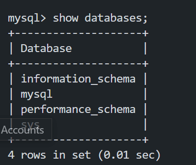

Create and configure two Linux-based virtual servers (EC2 instances in AWS) 

Server 1 name:  mysql server
Server 2 name:  mysql client

On mysql server Linux Server install MySQL Server software, run the code
`sudo apt install mysql server`

Result:

On mysql client, run the code
`sudo apt install mysql-client `

By default, both of your EC2 virtual servers are located in the same local virtual network, so they can communicate to each other using local IP addresses. Use mysql server's local IP address to connect from mysql client. MySQL server uses TCP port 3306 by default, so you will have to open it by creating a new entry in ‘Inbound rules’ in ‘mysql server’ Security Groups. For extra security, do not allow all IP addresses to reach your ‘mysql server’ – allow access only to the specific local IP address of your ‘mysql client’.

Change bind-address on Mysql-server to allow for connection from any IP address. Set the bind-address to 0.0.0.0 using the command below:

`sudo vi /etc/mysql/mysql.conf.d/mysqld.cnf 
`

Result: 

To connect to the mysql server, in your mysql client enter the following code.

`mysql -u newuser2 -h 18.234.44.89 -p` note: 18.234.44.89 is the private ip address of our server.

Now run 

`show database;`

Result:

We have successfully connected to a remote MySQL server and can perform SQL queries!