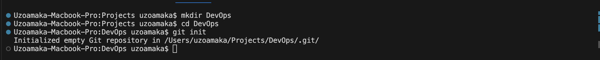
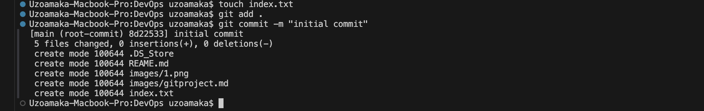

Make a new directory or Folder using this command `mkdir DevOps`
Move into the directory using the command `cd DevOps`
Then while inside the folder, run the command `git init`

To make the first commit, inside the working directory, create a file index.txt using the command `touch index.txt`
write anything of your choice and then save your changes.

Add your changes to git staging area using the command `git add  .`
To commit this change to git, run the command `git commit -m "initial commit`

### Working with branches

To make a new branch run this command `git checkout -b`
the `-b` helps to create and change into the new branch.
Use the command `git branch` to also list the branches on your local git repository.

**Change into a Old Branch**

To change into an exiting or old branch, use the command `git checkout <branch-name>`

**Deleting a git branch**
Git branch can be deleted with the command `git branch -d <branch_name>`

###Remote Repositories

To do this, you must have a preexisting github account or you create one on  <a href="https://www.github.com">Github.com</a>

To add a remote repository to the local repository, use the command `git remote add origin <link to your github repo>`

After commiting the changes in your local repository, You push the content to the remote repo using the command `git push origin <branch name>`

